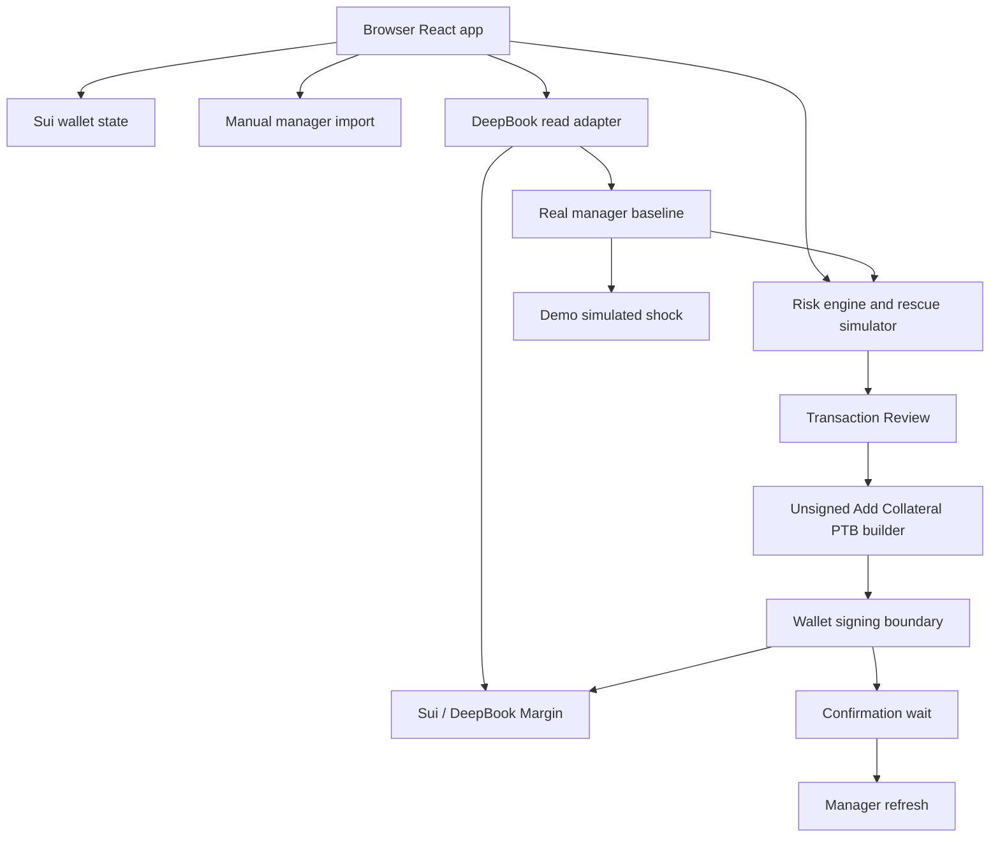

# MarginGuard

MarginGuard is a browser-only risk console and safety-gated Add Collateral PTB flow for DeepBook Margin on Sui.

It helps a user manually import a DeepBook Margin Manager, read current risk through Sui/DeepBook, understand whether rescue is needed, simulate rescue options, and review a gated Add Collateral PTB path when strict live gates allow it.

> Add Collateral PTB is implemented and safety-gated. Live signing is disabled by default. No live Add Collateral success should be claimed unless a real transaction digest is provided.

## 60-Second Judge Read

- **Problem:** DeepBook Margin users need to monitor risk ratio, liquidation threshold, debt exposure, and rescue options before liquidation pressure becomes urgent.
- **Solution:** MarginGuard turns a manually imported manager into a clear risk dashboard, rescue simulator, and review-first Add Collateral flow.
- **Architecture:** Static browser app only. No backend, no indexer, no keeper, no custody, no private keys.
- **Real today:** Wallet connection, manual manager import, Sui/DeepBook read path, risk dashboard, Add Collateral unsigned PTB builder, and gated wallet execution boundary.
- **Demo fallback:** Demo Mode simulates an action-needed scenario so judges can see the rescue flow even if the current real manager is healthy or unavailable.

## What Is Real, Simulated, And Gated

| Area | Status | Notes |
|---|---|---|
| Wallet connection | Real | Uses `@mysten/dapp-kit-react` in the browser. |
| Manual manager import | Real | User pastes a Margin Manager object ID. MarginGuard does not scan managers. |
| DeepBook manager read | Real | Reads the selected manager through browser-safe Sui/DeepBook adapters when configured. |
| Dashboard states | Real + deterministic fallbacks | Handles full, partial, read-error, unavailable, zero-debt, and no-rescue-needed states. |
| Rescue Simulator | Real baseline + estimates | Uses a real Mainnet SUI/USDC DeepBook baseline when eligible; otherwise falls back to clearly labeled simulated plans. |
| Demo Mode | Real baseline + simulated shock or simulated fallback | Can seed from the active real manager baseline, but price shock and stressed RR remain simulated. No wallet prompt opens from Demo Mode. |
| Add Collateral unsigned PTB | Implemented | Uses verified DeepBook `marginManager.depositQuote` path through the builder boundary. |
| Add Collateral live signing | Gated-live | Requires `VITE_ENABLE_LIVE_ADD_COLLATERAL === "true"`, real DeepBook action-needed state, acknowledgement, and re-read-before-sign. |
| Reduce-only / Smart TPSL | P1 / demo-only | Not implemented as live PTBs in this submission. |
| Backend / indexer / keeper | Not included | Intentionally out of scope for v0. |

## Core Demo Flow

1. Open the landing page and explain the browser-only safety boundary.
2. Connect wallet.
3. Import or select a SUI/USDC Margin Manager.
4. Show the real DeepBook Risk Snapshot if available.
5. If the current manager is healthy, show the no-rescue-needed gate.
6. Switch to Demo Mode and apply a simulated SUI price shock.
7. Show Warning/action-needed risk state and three rescue options.
8. Select Add Collateral and open Transaction Review.
9. Explain that wallet-signed execution is available only under live QA conditions: live flag, real action-needed DeepBook state, acknowledgement, and re-read-before-sign.
10. Use simulated result unless a real transaction digest exists.

Canonical demo script: [docs/DEMO_SCRIPT.md](docs/DEMO_SCRIPT.md).

## Local Development

Prerequisites:

- Node.js 20+
- pnpm 10+
- Sui wallet browser extension for wallet QA

Setup:

```powershell
pnpm install
Copy-Item .env.example .env.local
pnpm dev
```

Run the app directly from the web package:

```powershell
pnpm -C apps/web dev --host 127.0.0.1
```

## Environment Variables

`.env.example` documents safe defaults. Live Add Collateral signing is disabled unless the value is exactly lowercase `true`.

| Variable | Default | Purpose |
|---|---|---|
| `VITE_SUI_NETWORK` | `mainnet` | Default app network for demo/read flows. |
| `VITE_SUI_FULLNODE_URL` | empty | Optional override for Sui fullnode URL. |
| `VITE_ENABLE_LIVE_ADD_COLLATERAL` | `false` | Must be exactly `true` for controlled manual live Add Collateral QA. |

Do not put private keys, seed phrases, wallet secrets, or real manager IDs in env files.

## Verification Commands

Use pnpm only:

```powershell
pnpm -C apps/web typecheck
pnpm -C apps/web lint
pnpm -C apps/web test
pnpm -C apps/web build
pnpm typecheck
pnpm lint
pnpm test
pnpm build
pnpm verify:submission-safety
```

## Static Deployment

MarginGuard is a static Vite app. Build output is generated at `apps/web/dist`.

```powershell
pnpm -C apps/web build
```

Deploy only static files from `apps/web/dist` to a static host such as Vercel static output, Netlify, Cloudflare Pages, GitHub Pages, or Sui-compatible static hosting.

Public demo deployments should keep:

```text
VITE_ENABLE_LIVE_ADD_COLLATERAL=false
```

Only enable live Add Collateral during controlled manual QA with a user-controlled action-needed manager and a small amount acceptable to lose. See [docs/LIVE_ADD_COLLATERAL_QA.md](docs/LIVE_ADD_COLLATERAL_QA.md).

## Architecture



Boundary summary:

- All reads happen from the browser through Sui/DeepBook adapters.
- Every write requires Transaction Review and explicit wallet approval.
- Re-read-before-sign blocks stale, healthy, zero-debt, unavailable, read-error, mock, or demo states.
- localStorage stores only manager references and preferences, not chain state as truth.
- There is no backend, indexer, keeper, relayer, custody service, or private-key handling.

## Known Limitations

- SUI/USDC is the only supported live path.
- Current real Mainnet manager used during QA is healthy/no-rescue-needed and must remain blocked from signing.
- Add Collateral live submission has not been claimed successful in this repo because no real digest has been provided.
- Reduce-only and Smart TPSL are visible as P1/demo-only paths, not live PTBs.
- Rescue Simulator projections are estimates even when seeded from a real DeepBook baseline.
- Demo Mode can use a real DeepBook baseline, but simulated shock values and stressed RR must not be presented as live chain state.

## Documentation

- [Architecture](docs/ARCHITECTURE.md)
- [Development Plan](docs/DEVELOPMENT_PLAN.md)
- [Task Breakdown](docs/TASK_BREAKDOWN.md)
- [Demo Script](docs/DEMO_SCRIPT.md)
- [Final Demo QA](docs/FINAL_DEMO_QA.md)
- [Live Add Collateral QA](docs/LIVE_ADD_COLLATERAL_QA.md)
- [Deployment](docs/DEPLOYMENT.md)
- [Submission Checklist](docs/SUBMISSION_CHECKLIST.md)

## Risk Disclaimer

MarginGuard is a hackathon MVP and educational risk-management interface. It does not guarantee liquidation prevention. Users must verify manager ID, connected wallet, network, asset, amount, and final wallet transaction details before signing. MarginGuard does not custody funds and cannot reverse a transaction after the user signs it.
