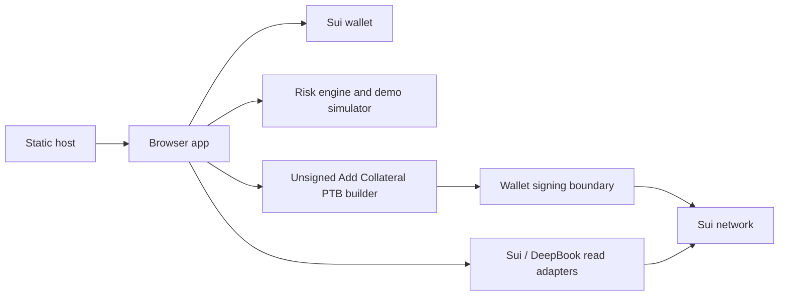

# Static Deployment

MarginGuard v0 is a static browser app. It should be deployed as static files only.

## Build

```powershell
pnpm -C apps/web build
```

Output directory:

```text
apps/web/dist
```

## Static Hosts

Suitable targets include:

- Vercel static output
- Netlify
- Cloudflare Pages
- GitHub Pages
- Any static object hosting/CDN

Do not add API routes, serverless functions, databases, workers, indexers, keepers, relayers, custody services, or private-key services for deployment.

## Environment Defaults

Public demo deployments should keep live Add Collateral disabled:

```text
VITE_ENABLE_LIVE_ADD_COLLATERAL=false
```

The app enables live Add Collateral signing only when:

```text
VITE_ENABLE_LIVE_ADD_COLLATERAL=true
```

The value must be exactly lowercase `true`. Use this only for controlled manual QA with a user-controlled action-needed Mainnet manager.

## Deployment Record

Deployed URL: `____________________________`

Host: `____________________________`

Build command: `pnpm -C apps/web build`

Output directory: `apps/web/dist`

Live Add Collateral enabled: `No / Yes for controlled manual QA only`

## Architecture Diagram



## Public Demo Safety

- Keep live signing disabled unless intentionally testing controlled live Add Collateral.
- Do not publish full manager IDs in screenshots, videos, or docs.
- Do not claim live Add Collateral success without a real digest.
- Do not claim automatic liquidation protection.
- Use Demo Mode fallback if no safe action-needed manager exists.
